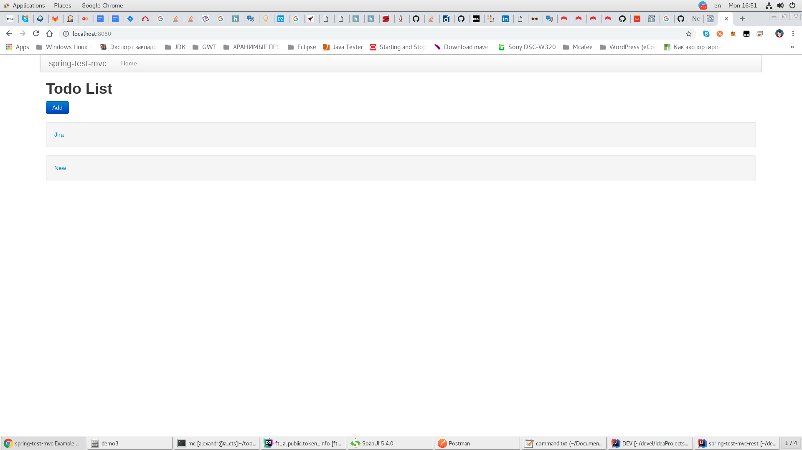

# Integration Testing (DBUnit) of Spring

* `Integration Testing of Spring MVC Applications: REST API, Part One` https://www.petrikainulainen.net/programming/spring-framework/integration-testing-of-spring-mvc-applications-rest-api-part-one/
* `Integration Testing of Spring MVC Applications: REST API, Part Two` https://www.petrikainulainen.net/programming/spring-framework/integration-testing-of-spring-mvc-applications-rest-api-part-two/
* `spring-mvc-test-examples/rest` https://github.com/pkainulainen/spring-mvc-test-examples/tree/master/rest

RUNNING THE APPLICATION:

- Запустить веб-приложения через команду
  ```bash
  mvn clean jetty:run
  ```
- Запустите свой браузер и перейдите по адрессу
  [http://localhost:8080](http://localhost:8080)

- или запустить веб-приложения с помощью физического сервера приложения JBOSS (через IntelliJ IDEA)
  * Deployment `spring-test-mvc-configuration:war exploded`
  * Server [http://localhost:8080/spring-test-mvc-configuration/](http://localhost:8080/spring-test-mvc-configuration/)
- Запустите свой браузер и перейдите по адрессу
  [http://localhost:8080/spring-test-mvc-configuration/](http://localhost:8080/spring-test-mvc-configuration/)




RUNNING TESTS:

- Вы можете запускать JUnit-тесты с помощью этой команды
  ```bash
  mvn test -P dev
  ```
- Вы можете выполнить интеграционные тесты, используя эту команду
  ```bash
  mvn verify -P integration-test
  ```


---

* `Spring Test DBUnit` https://springtestdbunit.github.io/spring-test-dbunit/sample.html
* `spring-test-dbunit-example` https://github.com/philwebb/spring-test-dbunit-example
